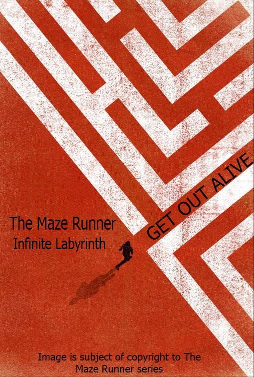

<h1>Overview</h1>

<h1>Theme / Setting / Genre</h1>
<ul>
	<li>Advanture</li>
  <li>Puzzle</li>
  <li>Strategy</li>
 </ul>

<h1>Project Description</h1> 
  Our project for this course, Computer Graphic, is a maze game with a genre of adventure, puzzle, and strategy. We named our game for the project is “The Maze Runner : Infinite Labyrinth”. Why we named it like that? Because when you go inside and trap in the maze you can not go out of the maze.
  The background of why we decided to make game maze is because a game with a concept maze and try to win with collect an object is very rare in this era, usually those game were famous back in the 2000’s where the game view is 2D so we decided to make the game with 3D concept.
  The game will consist of a maze from walls, a character that the player will control, a ground, sky, apple for the character to collect so the character could win the game and solve the mystery of the whole maze.
  In this game the character will play as Third person shooter (TRD). where the camera will follow the character movements from behind. The character itself we used Leon from Resident Evil 4 game. We chose Leon because the character Leon fits the situation of the game.

<h1>Core Gameplay Mechanics Brief</h1>
  <h3>Keyboard</h3>
<ul>
	<li>W key - In order to move forward </li>
  <li>A key - In order to move left</li>
  <li>S key - In order to move backward</li>
  <li>D key - In order to move right</li>
</ul>
 
  <h3>Mouse</h3>
<ul>
  <li>Mouse left click + ( Slide mouse to right ) - Rotate camera clockwise</li>
  <li>Mouse left click + ( Slide mouse to left ) - Rotate camera counterclockwise</li>

</ul>

<b4>
<h1>Targeted platforms</h1>
	
Web Based Game

    <ul>
      <li>Mozilla Firefox</li>
    </ul>

 
<h1>Project Scope</h1>
<ul> 
  <li>Game Time Scale </li>
    <ul>
      
This game usually took two minutes of gameplay in average. It depends on where the apple spawn, because in this game the apple is set to random in the map. If the apple spawn in front of the character, the game will be short but if the character spawn far away from the character the player must walk wall to wall to find the apple and it will take time for that.
		     
    Shortest gameplay	: < 1 minute  
		Average		: 2 minutes  
		Longest gameplay	: > 3 Minutes

    </ul>
</ul>
	

<h1>Team Size</h1>
<ul>
      <li>Core Team</li>
        <ul>
            <li>Giorgio Fasolini - 1901498082 - https://github.com/giorfasolini </li>
            <li>Ramada Atyusa - 1901498763 - https://github.com/ramadayusa </li>
        </ul>
</ul>
	
  <h1>What does they do?</h1>
<ul>
    <li> Giorgio Fasolini 
        <ul>
          I am the one who did coding to the maze. I was the one who implemented physics in the game to make the game even more real, The physics included impulse, restitution, and gravity. All of the walls and the character have been applied with impostor so that they can detect collisions with each other more clearly, when the character acceleration is too fast to the wall, the impulse shall apply and the character will receive force equal to his acceleration, and in the end character will fall. 
I was also the one who made the apple in the blender, I also make it so the apple will appear random every time the scene is rendered, should the apple is intersected with any other wall, the location will be re-randomized, Therefore the apple will always random and it will never stuck inside the wall. 
I also implemented skybox i have previously learned in class, for more elaborate background, we chose sky because we think that besides it is beautiful, a sky background is also more freshening and made player’s spirit more fired up 
Lastly i implemented camera lock based on its radius axis, so that the player cannot zoom-in or zoom-out to cheat to view the maze.  
        </ul>
   </ul>
   
   
   <ul>
    <li> Ramada Atyusa 
        <ul>
          For the front end project, I decided to search for the character object that will be played in the game. I decided to took Leon as the character because it fits for the game but the model is not good enough when I did the animation so I need to weight painting the character to make it nicer
	The character model I implemented armature bone for the animation. I created the animation for walk to the character  so it could be use in the game
 
Back end
For the back end I made the fixed camera of the third person shooter because the default camera is at the opposite that we want to be so I need to adjust it. For the camera also I made the the intersect with the wall so the camera cannot rotate through the wall. After that I decided to lock based on beta axis so player cannot rotate to up and down.
I also made the character implementation in babylon so when the player press W, A, S, and D the character will do the walk animation
And the last one is I made the walls for the maze. And make the pattern of the maze so the maze is little bit hard. And I decided to give the texture to the wall and ground to make it more realistic.
  

   </ul>
        
    
<h1>Licenses / Hardware </h1>
<ul>
  <ul>
   
Tested In

    <ul>
          <li>
          Laptop ASUS P450L  
          Processor		: Intel Core i5 4210U 
          RAM			: 8 GB 
          VGA			: Nvidia 820m 
          Operating System	: Windows 8.1 Pro  
          </li>
           
          <li>           
    Laptop ASUS ROG GL552JX  
    Processor		: Intel Core i7 4720HQ  
    RAM			: 4 GB  
    VGA			: Nvidia 950m  
    Operating System	: Windows 10       
          </li>
     </ul>
</ul>

  

<h3>List Of library being used</h3>
  <ul>
    <li>babylon.js</li>   
    <li>babylonObjLoader</li>   
    <li>Hand-1.3.7</li>   
    <li>Blender</li>  
    <li>CSS</li>  
     <li>.Html</li>    
  </ul>

<h1>Story</h1> 

The story is about a man both as famous detective and adventurer, he has conquered many puzzles and mysteries all around the world, and his hard work turned fruitful in form of fame and reputation. Now he seeks to conquer the last and most difficult maze in the world that no one has ever completed before.

<h1>Gameplay</h1>

For our gameplay of the maze game, the player must search an apple to win the game but the difficulty is the maze and the camera. We set the camera to lock the Z axis and Y axis so it makes the game more difficult because the player cannot zoom in and zoom out the map. The maze also difficult because we manage to make the maze hard so the player will confused when the are in the maze.
	For the controller in the game, the game will set at third person shooter and the player will use the character to explore the maze. As in general, to move the character forward press W button, to backward press S button, to turn left press A button, and to turn right press D button. And also, the player need to use mouse in the gameplay so the player can see the environment around him. Player needs to left click and slide the mouse to the right to turn the camera to the right and click left mouse and slide the camera to the left to turn the camera to the left 
	

<h1>Assets Needed</h1>

- 2D
	- Textures
		- Environment Textures
	- Heightmap data (If applicable)
		- List required data required - Example: DEM data of the entire UK.
	- Etc.
- 3D
	- Characters List
		- Character #1
		- Character #2
		- Character #3
		- etc.
	- Environmental Art Lists
		- Example #1
		- Example #2 
		- Example #3
		- etc.
- Animation
	- Environment Animations 
		- Example
		- etc.
	- Character Animations 
		- Player
- Example 
- etc.
		- NPC
			- Example
			- etc.

Schedule
	- <Object #1>
		- Time Scale
			- Milestone 1
			- Milestone 2
			- Etc.
	
Full Coding
	- <Put your group CS Github url/link>
		- <Copy all your code>
			- <Please give comments on your code)

Screenshot of the Game
<put images of your game>

